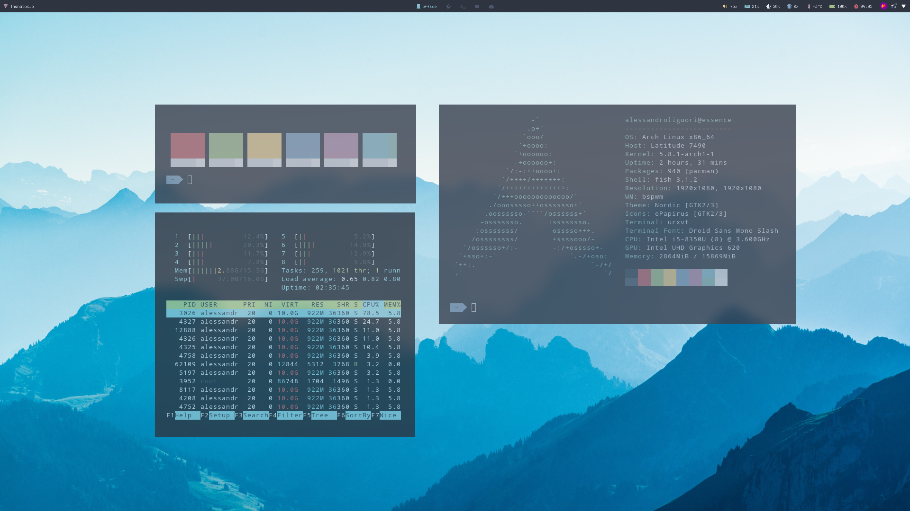

# Nordic Faint Theme

## Description

Nordic Faint theme for Bspwm, inspired by [u/raj2612](https://www.reddit.com/user/raj2612/) and his theme [Faint](https://www.reddit.com/r/unixporn/comments/hvi0qv/bspwm_faint/) with Nordic color palette, re-adapted to use 1/2 screens and 10 desktops.

I've changed some of the softwares and part of the configurations files.

The theme has 2 wallpapers included. Unfortunately I didn't find the authors.

**Bonus point**: I've created a script ( [bsw_monitors](.config/scripts/bsw_monitors) ) to manage the multimonitor configuration inside bspwm and to reorganize them automatically in case of HDMI plug/unplug.

## Screenshots





_(More screenshots inside the Screenshots folder)_

## Desktops
1. Office
2. Web
3. Term
4. Files
5. Extra
6. Code
7. Personal
8. Music
9. DB
0. Remote

## Configuration

- OS: [Archlinux](https://www.archlinux.org/)
- WM: [BSPWM](https://github.com/baskerville/bspwm) + SXHKD
- Colorscheme: [Nord](https://www.nordtheme.com/)
- Bar: [Polybar](https://github.com/polybar/polybar) with custm script for ncspot/mpris
- Shell: [Fish](https://fishshell.com/)
- Fish theme (OMF): [Agnoster](https://github.com/oh-my-fish/theme-agnoster)
- Notification: [Dunst](https://dunst-project.org/)
- Multiple screen manager: [Autorandr](https://github.com/phillipberndt/autorandr)
- Music: Spotify with [ncspot](https://github.com/hrkfdn/ncspot)
- IM: Telegram with [Nord theme](https://t.me/addtheme/nord_colors) by [u/stropicciare](https://www.reddit.com/user/stropicciare/)
- Launcher: [Rofi](https://github.com/davatorium/rofi) with the [Nord theme](https://github.com/davatorium/rofi-themes/pull/32/files) by [rulrok](https://github.com/rulrok)
- Clipboard: [Greeclip](https://github.com/erebe/greenclip)
- Browser: [Firefox](https://www.mozilla.org/en-GB/firefox/new/)
- Wallpaper manager: [Nitrogen](https://github.com/l3ib/nitrogen)
- Compositor: [picom-ibhagwan](https://github.com/ibhagwan/picom)
- Terminal emulator: [rxvt-unicode](http://software.schmorp.de/pkg/rxvt-unicode.html)
- File browsers: [Ranger](https://github.com/ranger/ranger) and Thunar
- Screenshots applet/software: [Flameshot](https://github.com/lupoDharkael/flameshot)
- IDE: [Visual Studio Code](https://code.visualstudio.com/) with a [nord theme](https://www.nordtheme.com/ports/visual-studio-code)
- Editor: Vim with a [Nord theme](https://github.com/arcticicestudio/nord-vim)
- GTK Theme = [Nordic](https://www.gnome-look.org/p/1267246/)
- GTK Icon Theme = [ePapirus](https://github.com/PapirusDevelopmentTeam/papirus-icon-theme)
- GTK Font = Cantarell 11
- GTK Cursor Theme = Adwaita

For more information about the installed software please take a look at the file: **packages.txt**

## Installation

1. Clone this repository
2. Replace the `alessandroliguori` with your username from all the configuration files `.config` folder. Use 
`egrep -lRZ '\[USERNAME\]' . | xargs -0 -l sed -i -e "s/\[USERNAME\]/$USER/g"`. To search and replace it automatically.
3. Change the variables inside the file `.config/scripts/bsw_monitors`, use the command: `xrandr --query | grep " connected"` to know the names of your screens.
4. Configure **autorandr** and setup all your profiles. I personally use `mobile` (single screen) and `dual_home` (dual screen at home)
5. Copy the files from this folder to your home folder.

*Optional*: install all my softwares using the command:
```
yay -S --needed --noconfirm - < ~/packages.txt
```